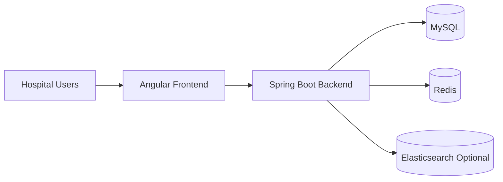

# Artem Health HMS

Production-oriented Hospital Management System (HMS) built as a modular monolith with:

- Spring Boot 3 backend
- Angular 17 frontend
- MySQL, Redis, and Elasticsearch support

This repository is designed for real hospital operations: secure access control, workflow-driven care, inventory and billing correctness, auditability, and production-safe behavior.

## What This Project Solves

Hospitals often struggle with fragmented systems for registration, consultation, pharmacy, billing, and operational tracking.

This HMS unifies those concerns into a single platform with:

- Role-based workspaces for operations and clinical staff
- End-to-end patient journey handling (registration to billing)
- Recoverability (soft delete restore)
- Configurable workflow orchestration
- Audit trail and security controls

## Monorepo Structure

- `backend/`: Spring Boot service and domain modules
- `frontend/`: Angular SPA and role-based UI workspaces
- `docker-compose.yml`: local infra stack (MySQL, Redis, Elasticsearch)
- `docs/`: advanced feature documentation and architecture decisions

## System Design (Quick View)



Detailed diagrams and sequence flows are available in [docs/system-design.md](docs/system-design.md).

## Core Modules

- Authentication and JWT session management
- User and role administration
- Patient management
- Appointment booking and queueing
- Staff/doctor onboarding
- Prescription lifecycle
- Pharmacy inventory and stock logs
- Billing and payment tracking
- Dashboard metrics
- Audit trail
- Workflow engine (definition + runtime instance controls)
- System admin recovery operations

## Engineering Highlights

- Spring Security with method-level authorization
- Redis-backed rate limiting (Bucket4j)
- Caching and distributed lock support (Redis + Redisson)
- JPA/Hibernate with auditing support (Envers)
- MapStruct mapping layer
- Angular standalone architecture with guards and interceptors
- API response standardization
- Production-safe startup and configuration validation

## Quick Start

### Prerequisites

- Java 17+
- Node.js 18+
- Docker (optional, for infra)

### 1) Start infrastructure (recommended)

```bash
docker-compose up -d
```

This starts:

- MySQL on `3306`
- Redis on `6379`
- Elasticsearch on `9200`

### 2) Run backend

```bash
cd backend
.\mvnw.cmd clean spring-boot:run
```

Backend default URL: `http://localhost:8081`

### 3) Run frontend

```bash
cd frontend
npm install
npm start
```

Frontend default URL: `http://localhost:4200`

## Build and Validation

### Backend

```bash
cd backend
.\mvnw.cmd clean -DskipTests compile
```

### Frontend

```bash
cd frontend
npm run build
```

### Root scripts

```bash
npm run frontend:start
npm run frontend:build
npm run lint
```

## Configuration

Primary runtime configs are in backend application properties and environment variables.

Common variables:

- `HMS_DB_URL`
- `HMS_DB_USERNAME`
- `HMS_DB_PASSWORD`
- `JWT_SECRET_KEY`
- `REDIS_HOST`
- `REDIS_PORT`
- `SPRING_PROFILES_ACTIVE`

## Advanced Documentation

For deep technical details, see:

- [docs/README.md](docs/README.md)
- [docs/advanced-features.md](docs/advanced-features.md)
- [docs/system-design.md](docs/system-design.md)
- [backend/README.md](backend/README.md)
- [frontend/README.md](frontend/README.md)

## Feature Roadmap Status (High Level)

- Foundation and platform hardening: in progress
- Workflow definition and runtime controls: implemented base
- Admin recovery controls: implemented
- Frontend workflow operations and UI consistency: implemented base
- Next: production-grade workflow reliability, role task inbox, SLA/escalation, and rollout hardening

## Notes

This codebase is actively evolving. If you are onboarding a team, start with:

1. [docs/README.md](docs/README.md)
2. [backend/README.md](backend/README.md)
3. [frontend/README.md](frontend/README.md)
