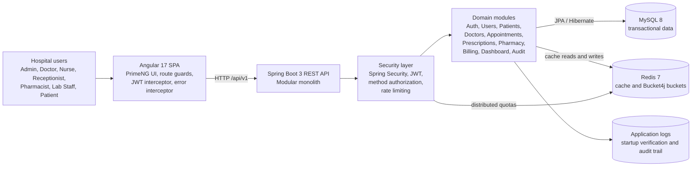
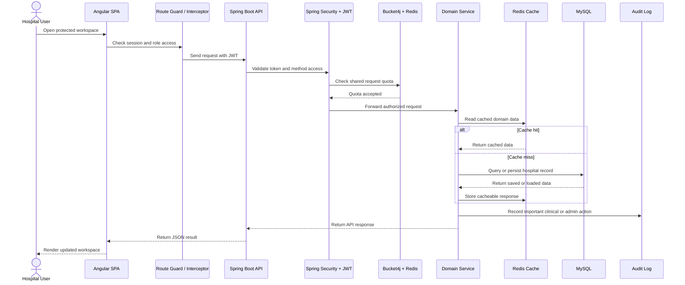

# Artem Health HMS

Production-oriented Hospital Management System built as a modular monolith with a Spring Boot 3 backend and Angular 17 frontend. The application covers patient registration, appointments, doctor onboarding, prescriptions, pharmacy inventory, billing, audit logging, and role-based access control.

## Table of Contents

- [Architecture](#architecture)
- [System Diagram](#system-diagram)
- [Implemented Features](#implemented-features)
- [Application Flow](#application-flow)
- [Production Hardening Included](#production-hardening-included)
- [Role Workspaces](#role-workspaces)
- [Role Module APIs](#role-module-apis)
- [Local Setup](#local-setup)
- [Configuration](#configuration)
- [Production Safety](#production-safety)
- [Security Notes](#security-notes)
- [Troubleshooting](#troubleshooting)
- [Verification](#verification)

## Architecture

- Backend: Spring Boot 3.3, Spring Security 6, Spring Data JPA, Hibernate, MapStruct, Lombok, Bucket4j, Redis.
- Frontend: Angular 17 standalone components, PrimeNG, RxJS, route guards, HTTP interceptors.
- Database: MySQL 8 and Redis 7 (caching & rate limiting) for normal runtime.
- Security: JWT access tokens, refresh-token rotation/revocation, BCrypt password hashing, method-level authorization, security headers, and distributed Redis-backed rate limiting.
- Caching: Multi-level caching for Doctor, Patient, and Medicine entities to reduce DB load and improve response times.

## System Diagram



## Sequence Diagram



## Implemented Features

- Authentication and session management with login, registration, change password, JWT access tokens, refresh-token rotation, logout revocation, and BCrypt password hashing.
- Role-based access for ADMIN, DOCTOR, NURSE, RECEPTIONIST, PHARMACIST, LABORATORY_STAFF, and PATIENT across backend method security and Angular route/sidebar visibility.
- Dashboard workflows for operational summaries, weekly statistics, department statistics, and appointment views.
- Patient management with registration, patient directory, patient-owned `/me` access, duplicate-patient handling, and slice-based list loading.
- Appointment management with booking, appointment list views, doctor availability checks, slot conflict prevention, status tracking, and patient-owned appointment access.
- Staff and doctor onboarding with doctor registration, doctor directory, department mapping, and indexed doctor lookup paths.
- Prescription workflows with prescription creation from appointments, prescription details, patient prescription access, and prescription medicine line items.
- Pharmacy workflows with medicine catalog management, restock and dispense operations, inventory transaction logging, stock validation, and medicine slice endpoints.
- Billing workflows with bill creation, bill items, payment status and method handling, patient billing access, and patient payment action support.
- Audit logging for administrative visibility through `GET /api/v1/audit-logs/slice?page=0&size=25` and the Angular `/audit-logs` page.
- Production-oriented platform behavior including soft delete, centralized exception responses, validation errors, CORS configuration, startup database verification, logging configuration, caching, and distributed rate limiting.

## Application Flow

1. A user signs in from the Angular application on `http://localhost:4200`.
2. The frontend stores the authenticated session through the auth service and sends API requests through the JWT interceptor.
3. Spring Security validates the token, applies role and method authorization, and enforces Redis-backed rate limits before requests reach domain modules.
4. Domain services perform validation, ownership checks, soft-delete-aware data access, audit logging, caching, and persistence through Spring Data JPA.
5. MySQL stores hospital records while Redis supports shared rate-limit buckets and cache entries for high-traffic entities.
6. Angular route guards, role-route maps, sidebar visibility, modals, and interceptors keep the user experience aligned with backend access rules.

## Production Hardening Included

- Soft delete is enabled at the base entity layer so repository deletes keep medical and operational records recoverable.
- Bucket4j rate limiting is wired into the Spring Security filter chain with Redis-backed persistence. Quotas are shared across all backend instances for consistent traffic management.
- `@PreAuthorize` rules are active through method security.
- High-traffic database access paths have entity-level indexes for users, patients, doctors, appointments, prescriptions, medicines, inventory transactions, and billing.
- Large directory-style resources expose slice endpoints as a non-breaking alternative to full-list reads:
  - `GET /api/v1/patients/slice?page=0&size=25`
  - `GET /api/v1/doctors/slice?page=0&size=25`
  - `GET /api/v1/medicines/slice?page=0&size=25`
  - `GET /api/v1/users/slice?page=0&size=25`
- Angular services include matching slice methods and handle `429 Too Many Requests` responses cleanly.
- Frontend route/sidebar role visibility is aligned for patient and staff workflows.
- Dedicated role workspaces and backend APIs are available for nursing triage, laboratory specimen handling, and patient self-service guidance.
- Startup verification logs the running project path, active profile, web port, frontend API URL, DB URL, active schema, DDL mode, and table count. In production profiles, the backend refuses to start with the default JWT secret or unsafe Hibernate DDL mutation settings.
- Admin audit trail UI is available at `/audit-logs`.

## Role Workspaces

- `ADMIN`: full operations, users, staff, pharmacy, billing, lab, and nursing oversight.
- `DOCTOR`: appointments, prescriptions, patients, and clinical dashboard workflows.
- `NURSE`: nursing workbench, patient triage, check-in handoff, patients, and appointments.
- `RECEPTIONIST`: patient registration, appointment booking, staff directory, and billing.
- `PHARMACIST`: pharmacy inventory, inventory logs, prescriptions, and patient lookup.
- `LABORATORY_STAFF`: laboratory workbench for sample and result workflow coordination.
- `PATIENT`: patient portal for appointments, bills, prescriptions, lab reports, and demographic profile access.

## Role Module APIs

- Nursing triage: `POST /api/v1/nursing/triage`, `GET /api/v1/nursing/triage/patient/{patientId}`
- Laboratory orders: `POST /api/v1/lab/orders`, `GET /api/v1/lab/orders`, `GET /api/v1/lab/orders/patient/{patientId}`
- Laboratory workflow: `PATCH /api/v1/lab/orders/{id}/status`, `PATCH /api/v1/lab/orders/{id}/result`
- Patient portal: `GET /api/v1/patient-portal/summary`
- Patient billing: `GET /api/v1/billings/me`, `PATCH /api/v1/billings/{id}/pay`
- Patient-owned APIs: `GET /api/v1/patients/me`, `GET /api/v1/appointments/me`, `GET /api/v1/prescriptions/me`, `GET /api/v1/lab/orders/me`
- Audit trail: `GET /api/v1/audit-logs/slice?page=0&size=25`

## Local Setup

### Prerequisites

- JDK 17+
- Node.js 18+
- Maven wrapper included in `backend/`
- MySQL 8+
- Redis 7+ (for caching and rate limiting)

### Backend

```bash
cd backend
set HMS_DB_URL=jdbc:mysql://localhost:1234/data?createDatabaseIfNotExist=true&useSSL=false&allowPublicKeyRetrieval=true
set HMS_DB_USERNAME=root
set HMS_DB_PASSWORD=your_password
set REDIS_HOST=localhost
set REDIS_PORT=6379
set JWT_SECRET_KEY=replace_with_a_strong_hex_secret
.\mvnw.cmd spring-boot:run
```

The backend runs on `http://localhost:8080` by default.

### Frontend

```bash
cd frontend
npm install
npm start
```

The frontend runs on `http://localhost:4200` by default.

## Configuration

Important backend settings live in `backend/src/main/resources/application.properties` and can be overridden with environment variables.

- `HMS_DB_URL`, `HMS_DB_USERNAME`, `HMS_DB_PASSWORD`: database connection.
- `JWT_SECRET_KEY`: production JWT signing secret.
- `SERVER_PORT`: backend HTTP port. Defaults to `8080` and must match Angular `environment.apiUrl`.
- `HMS_FRONTEND_API_URL`: API URL logged during startup to prevent copied-project confusion. Defaults to `http://localhost:8080/api/v1`.
- `HMS_ALLOWED_ORIGINS`: comma-separated CORS origins. Dev default is `http://localhost:4200,http://127.0.0.1:4200`.
- `hms.rate-limit.enabled`: enable or disable distributed Bucket4j rate limiting.
- `hms.rate-limit.capacity`: maximum tokens per bucket.
- `hms.rate-limit.refill-tokens`: tokens restored per interval.
- `hms.rate-limit.refill-minutes`: refill interval in minutes.
- `REDIS_HOST`, `REDIS_PORT`: Redis connection for shared rate limiting and cache.
- `HMS_LOG_PATH` or `hms.logging.path`: canonical backend log directory. `npm run backend:start` writes backend logs and backend-run stdout/stderr files under `logs/backend`.

Redis is required for consistent distributed rate limiting and optimized caching in this version.

## Production Safety

Production profile names `prod` and `production` are guarded at startup:

- `spring.jpa.hibernate.ddl-auto=update`, `create`, or `create-drop` fails startup.
- The default JWT secret fails startup.
- Use `HMS_DDL_AUTO=validate` and a strong `JWT_SECRET_KEY` before production deployment.
- Cookies should be deployed with `hms.jwt.cookieSecure=true` and `hms.jwt.cookieSameSite=Lax` or `Strict`.

## Security Notes

- Patient-facing APIs use ownership checks in the service layer, not only route/controller guards.
- Patients should use `/patient-portal` and the `/me` endpoints.
- Patient ID based APIs remain staff/admin oriented unless service ownership checks permit the exact current patient.
- Refresh tokens are stored client-side only as HttpOnly cookies; logout revokes the current token hash and increments the user token version.
- Refresh now rotates the token version and revokes the previous refresh token.

## Troubleshooting

- If a copied project shows old data, check which Java process owns port `8080`.
- The startup log must say `HMS Backend running from C:\Users\Piyush\Desktop\hms\backend`.
- If MySQL tables are empty but old users still appear, clear browser site data for `localhost` and stop any backend from `C:\Users\Piyush\Desktop\Project\backend`.
- If the frontend cannot connect, confirm `frontend/src/environments/environment*.ts` points to `http://localhost:8080/api/v1`.
- Use `docs/manual-route-validation.md` to confirm role route access after auth changes.

## Verification

Backend:

```bash
cd backend
.\mvnw.cmd -q -DskipTests compile
```

Frontend:

```bash
cd frontend
npm run build
```

The frontend build may report CommonJS optimization warnings from PDF/canvas-related dependencies. Those warnings do not block the build.
