# HMS System Design and Flow Diagrams

This document provides architecture, module, and sequence diagrams for core and advanced HMS features.

## 1) High-Level System Design

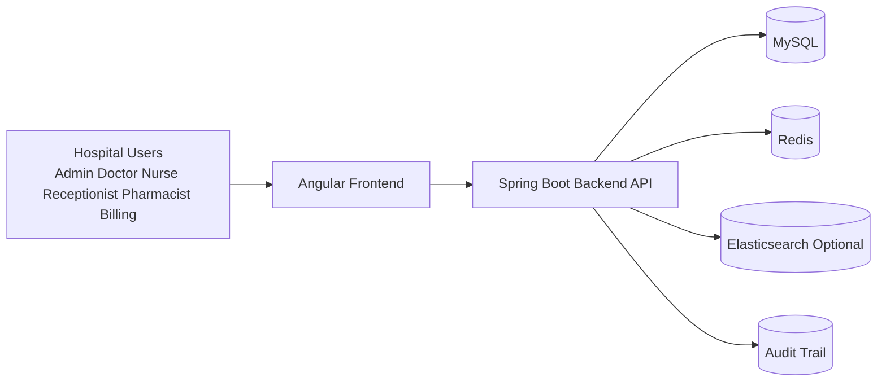

## 2) Backend Module Design

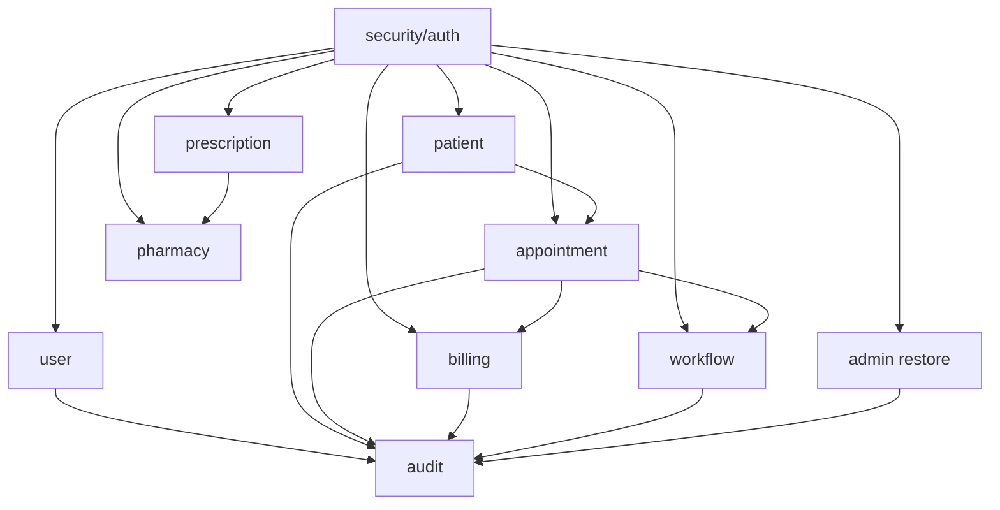

## 3) Request Processing Flow (Security + Rate Limit + Cache)

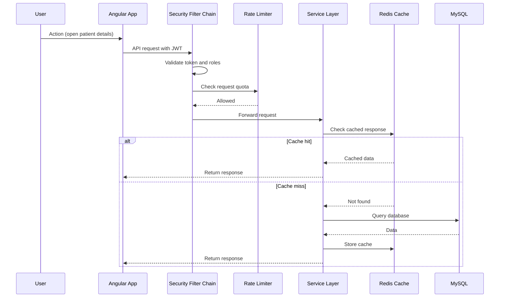

## 4) Appointment to Workflow Runtime Flow

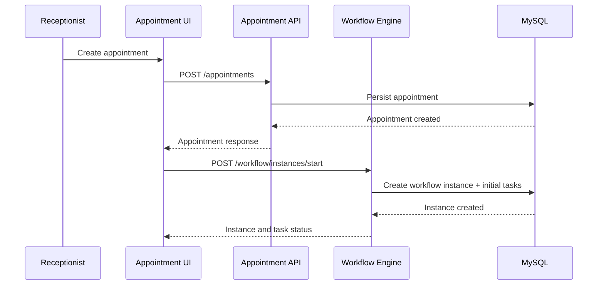

## 5) Workflow Transition and Approval Sequence

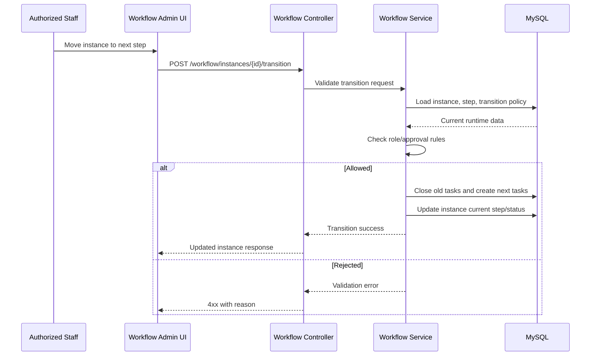

## 6) Soft-Delete Restore Flow (Advanced Admin Feature)

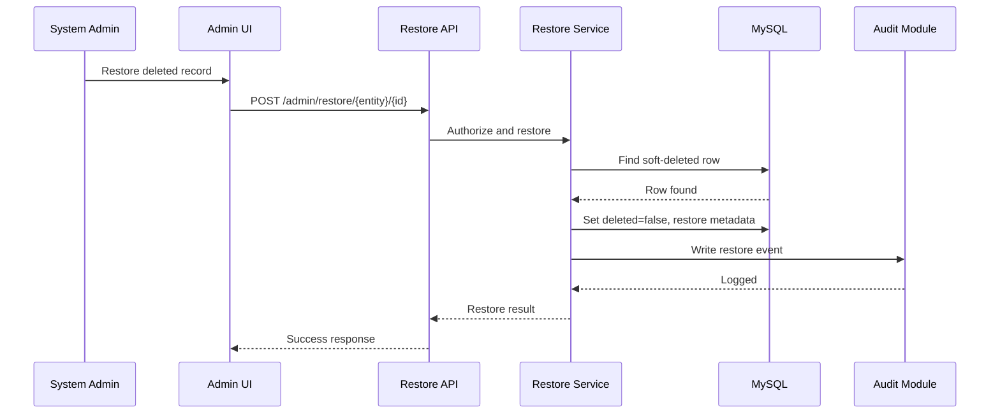

## 7) Advanced Feature Interaction Map

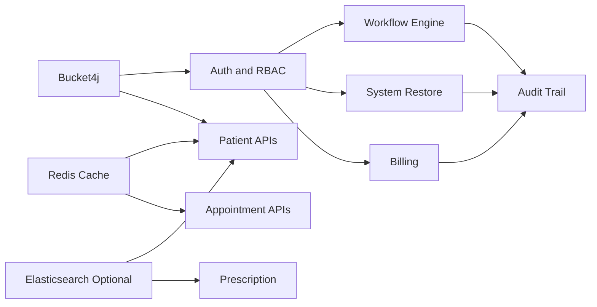

## 8) Feature Capability Diagram (Core + Advanced)

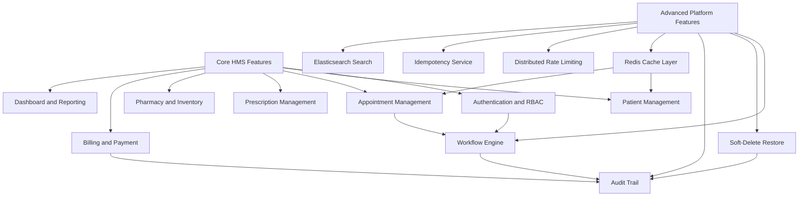

## 9) Activity Diagram (Patient Visit End-to-End)

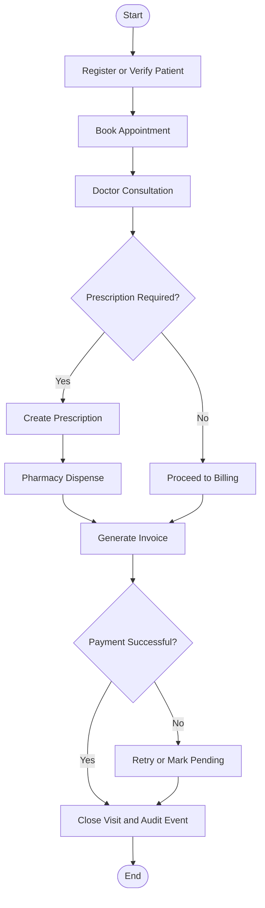

## 10) ER Diagram (Database Working Model)

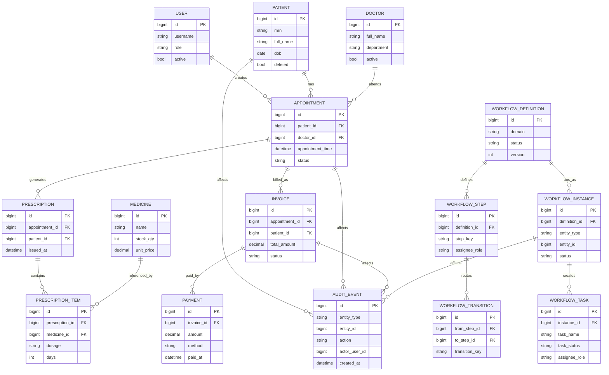

## 11) Redis and Idempotency Working Diagrams

### 11.1 Redis Runtime Responsibilities

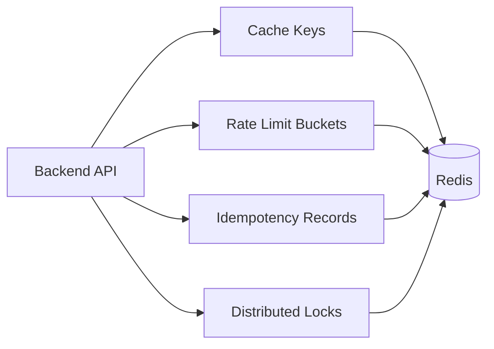

### 11.2 Idempotency Sequence (Safe Retries)

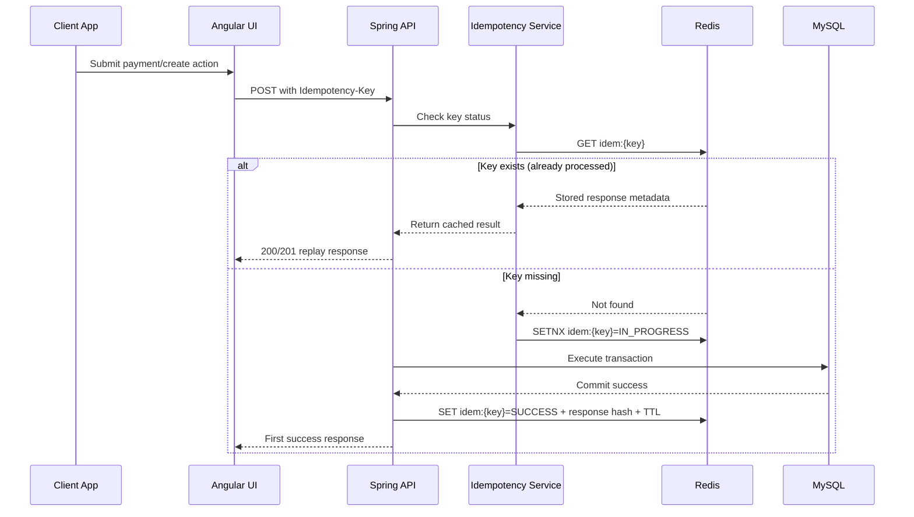

## 12) Notes for Contributors

- Keep sequence diagrams updated when endpoint contracts change.
- Keep module map aligned with package refactors.
- Add new advanced feature diagrams in this file and link from root README.
