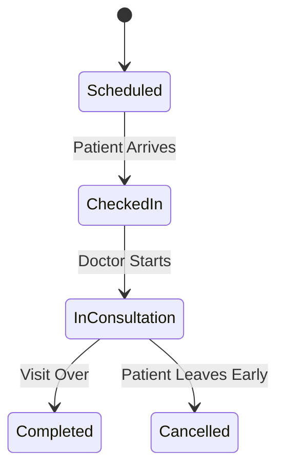

# Appointment Module Documentation

The `appointments` module manages the scheduling of patient visits.

## Components
- **AppointmentListComponent**: Calendar and list view for daily appointments.
- **AppointmentBookingComponent**: Wizard for selecting a doctor, date, and time slot.

## Services
- **AppointmentService**: Handles booking, status updates (Check-in, Start, Complete), and summary statistics.

## Logic Flow: Appointment Lifecycle

## Configuration (RBAC)
- **Booking**: ADMIN, RECEPTIONIST.
- **View Schedule**: ADMIN, DOCTOR, NURSE, RECEPTIONIST.
