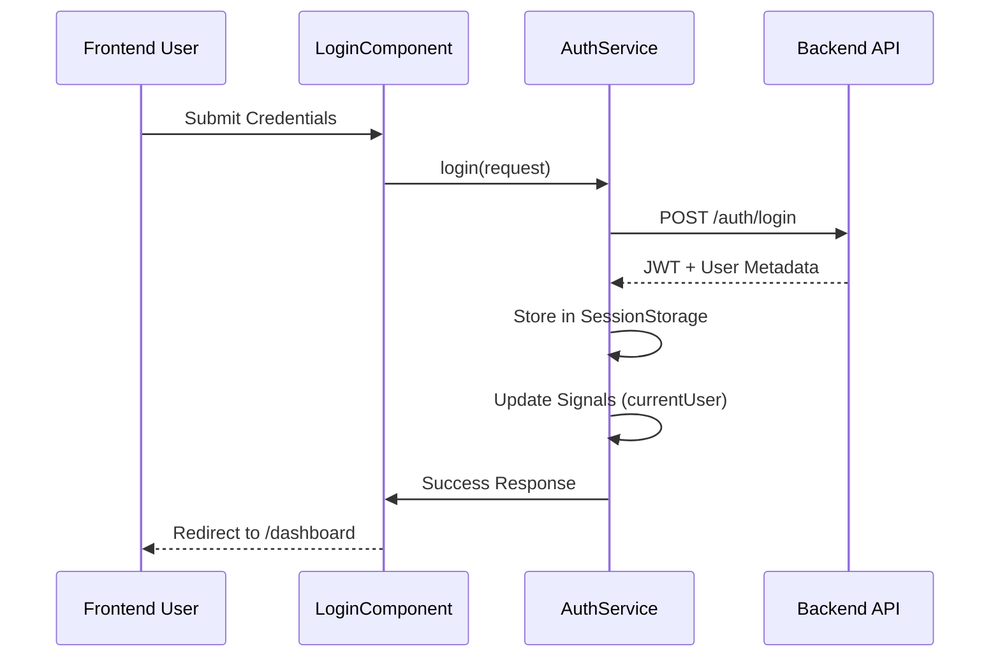

# Auth Module Documentation

The `auth` feature handles user authentication flows and identity management.

## Components
- **LoginComponent**: Collects credentials and initiates session.
- **RegisterComponent**: Handles user creation.
- **ChangePasswordComponent**: Manages mandatory or user-initiated password updates.
- **UnauthorizedComponent**: Static page shown when a user lacks route permission.

## Services
- **AuthService**: (See `core_module.md`)

## Logic Flow: Login Process

## Configuration (RBAC)
- **Login/Register**: Wrapped in `guestGuard`.
- **Change Password**: Wrapped in `authGuard`.
