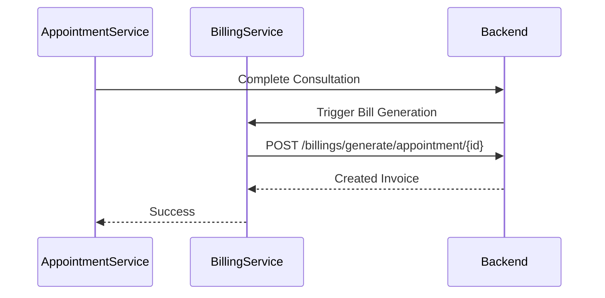

# Billing Module Documentation

The `billing` module manages invoicing and payment workflows.

## Components
- **BillingListComponent**: View all generated bills and their payment statuses.

## Services
- **BillingService**: Handles bill generation from appointments, status updates (Paid/Unpaid), and previews.

## Logic Flow: Bill Generation

## Configuration (RBAC)
- **Access**: Restricted to ADMIN and RECEPTIONIST.
