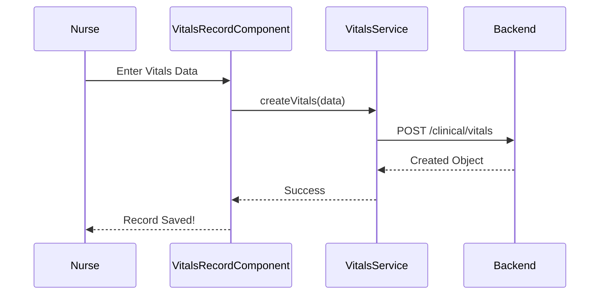

# Clinical Module (Vitals) Documentation

The `clinical` module focuses on the collection and tracking of patient medical data.

## Components
- **VitalsListComponent**: Shows a list of recent vitals recorded across the hospital.
- **VitalsRecordComponent**: Form used to record BP, Temperature, Pulse, etc., linked to a specific Appointment.

## Services
- **VitalsService**: Handles CRUD operations for vital signs.

## Logic Flow: Recording Vitals

## Configuration
- **Access**: Restricted to ADMIN and NURSE.
