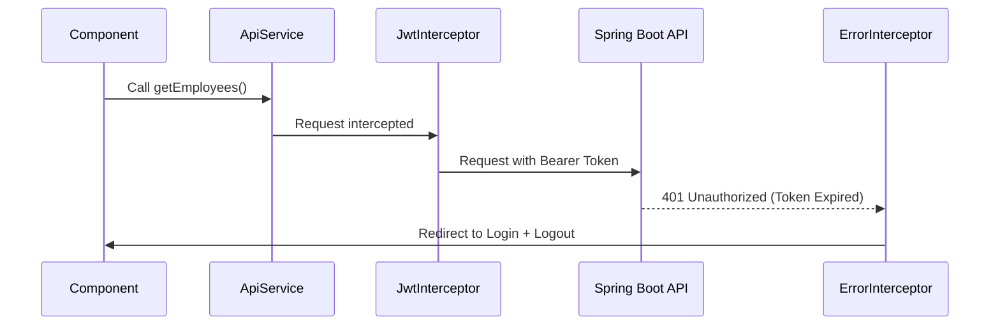

# Core Module Documentation

The `core` directory contains the foundational logic that powers the entire application.

## 1. Authentication Service (`auth.service.ts`)
The `AuthService` is the source of truth for the user's session.
- **State Management**: Uses **Angular Signals** (`currentUser`, `isAuthenticated`) for high-performance reactivity.
- **Persistence**: Stores tokens in `sessionStorage` to maintain session across page refreshes but clear on tab close.
- **Resilience**: Implements exponential backoff for login/registration retries.

## 2. Route Guards
- **`authGuard`**: Prevents unauthenticated users from accessing protected pages.
- **`guestGuard`**: Prevents logged-in users from accessing Login/Register pages.
- **`roleGuard`**: Implements RBAC (Role-Based Access Control) by checking `route.data.roles`.

## 3. Interceptors
- **`jwtInterceptor`**: Automatically attaches the `Authorization: Bearer <token>` header to all outgoing API requests.
- **`errorInterceptor`**: Centralized error handling.
    - **401**: Forces logout and redirects to login.
    - **403**: Shows the `AccessFeedbackModal`.
    - **500**: Displays a generic server error message.

## Logic Flow: HTTP Request

