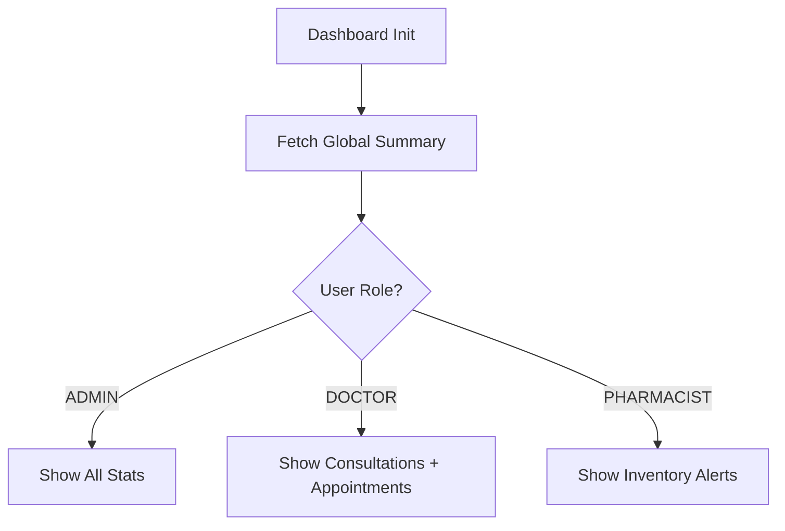

# Dashboard Module Documentation

The `dashboard` module is the primary landing zone for authenticated users.

## Components
- **DashboardComponent**: A role-aware dashboard that renders different widgets based on the user's role.

## Logic Flow: Data Retrieval
The dashboard calls `dashboardService.getSummary()` to fetch global stats (appointment counts, patient trends, etc.).

## Role-Based Configuration
Access is controlled via `roleGuard`.
- **Allowed Roles**: ADMIN, DOCTOR, NURSE, RECEPTIONIST, PHARMACIST, LABORATORY_STAFF.

