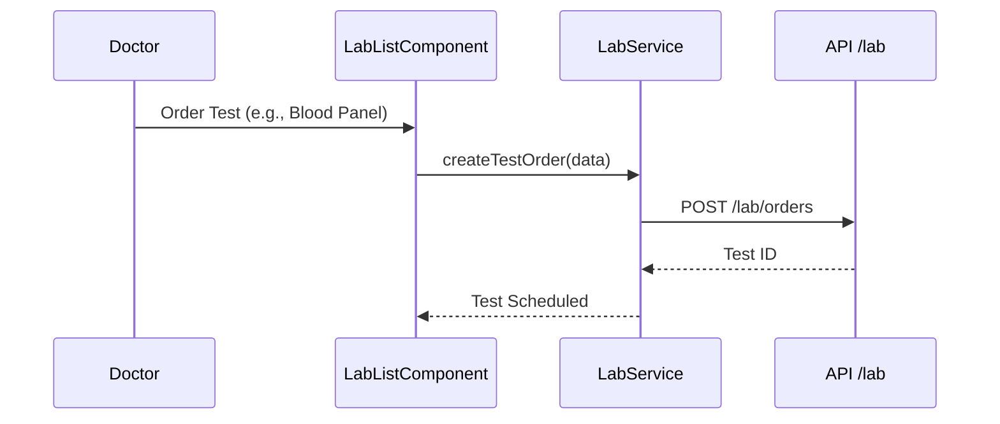

# Lab Module Documentation

The `lab` module manages diagnostic test orders and results.

## Components
- **LabListComponent**: Track pending and completed lab tests.

## Services
- **LabService**: Handles orders and test result uploads.

## Logic Flow: Test Ordering

## Configuration (RBAC)
- **Place Orders**: ADMIN, DOCTOR.
- **Manage Tests**: ADMIN, DOCTOR, LABORATORY_STAFF.
