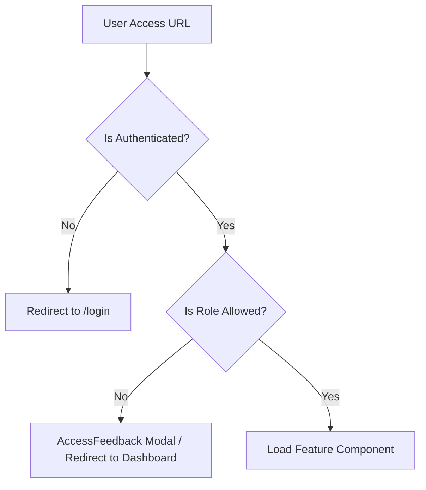

# HMS Frontend: System Overview

## Architecture
The Hospital Management System (HMS) frontend is built with **Angular (v17+)** using the **Standalone Components** architecture. This avoids the complexity of traditional `NgModules` and promotes a more modular, tree-shakable structure.

### Project Structure
- `src/app/core/`: Singleton services, guards, interceptors, and global models.
- `src/app/shared/`: Reusable UI components, layouts, and feedback modals.
- `src/app/features/`: Functional modules (Lazy-loaded) containing business logic.
- `src/environments/`: Configuration for different environments (Development, Production).

## Entry Point & Configuration
The application is initialized in `main.ts`, which uses `app.config.ts` to provide global providers:
- **Router**: Centralized in `app.routes.ts`.
- **HttpClient**: Configured with functional interceptors.
- **Animations**: Enabled for a premium UI feel.

## Routing Logic Flow
The application uses a guard-based routing strategy:
1. **Initial Load**: Redirects to `/login`.
2. **Auth Check**: `authGuard` verifies if a valid JWT exists in `sessionStorage`.
3. **Role Check**: `roleGuard` compares the user's role against the route's `data.roles` metadata.
4. **Lazy Loading**: Features are loaded only when the user navigates to them, optimizing initial bundle size.

