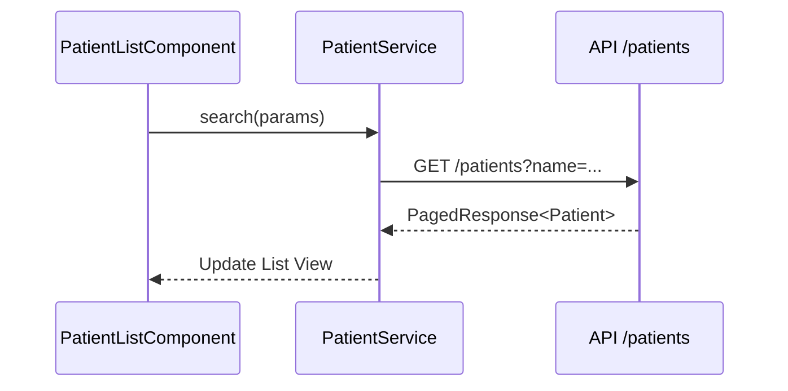

# Patient Module Documentation

The `patients` module handles the registration and lifecycle of patients in the HMS.

## Components
- **PatientListComponent**: Displays a paginated list of all patients with search filters (Name, Email, Blood Group).
- **PatientRegistrationComponent**: Form for registering new patients or editing existing ones.

## Services
- **PatientService**: Manages patient data synchronisation with the backend.

## Logic Flow: Patient Search

## Configuration (RBAC)
- **View List**: ADMIN, DOCTOR, NURSE, RECEPTIONIST, PHARMACIST.
- **Register Patient**: ADMIN, RECEPTIONIST.
