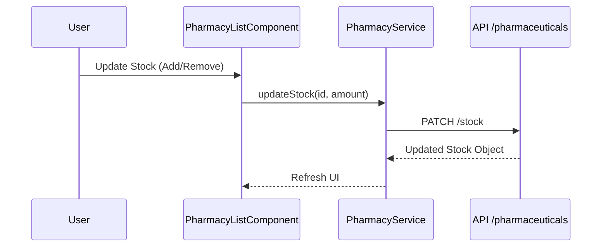

# Pharmacy Module Documentation

The `pharmacy` module manages drug inventory and stock movement.

## Components
- **PharmacyListComponent**: View and search medicine stock.
- **InventoryLogComponent**: Historical log of stock adjustments.

## Services
- **PharmacyService**: Handles stock updates and auditing.

## Logic Flow: Stock Update

## Configuration (RBAC)
- **Access**: Restricted to ADMIN and PHARMACIST.
