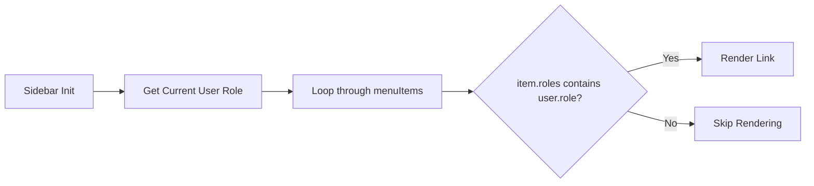

# Shared Module Documentation

The `shared` directory contains components and utilities used across multiple feature modules.

## 1. Layout System
The main layout is defined in `SidebarComponent` and `HeaderComponent`.

### Sidebar (`sidebar.component.ts`)
- **Dynamic Menu**: Uses a `menuItems` configuration array.
- **Role Verification**: The `canView()` method filters visibility based on `user.role`.
- **Active States**: Uses `routerLinkActive` for visual feedback.

## 2. Feedback Systems
### Access Feedback Modal
Used by `roleGuard` and `errorInterceptor` to notify users when they lack permissions.
- **Reactive Trigger**: Driven by `AccessFeedbackService` via an RxJS `BehaviorSubject`.
- **Global Presence**: Included in `app.component.html` so it can be called from anywhere.

## Configuration Flow: Sidebar Rendering

