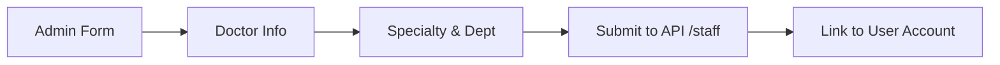

# Staff Module Documentation

The `staff` module manages doctors, their registration, and their availability.

## Components
- **DoctorListComponent**: View and manage all staff doctors.
- **DoctorRegistrationComponent**: Form for adding new doctors.
- **DoctorScheduleComponent**: Roster management for doctor availability.

## Logic Flow: Registration
New staff registration is restricted to Admin users.

## Configuration (RBAC)
- **Registration**: Restricted to ADMIN.
- **View Schedule**: ADMIN, RECEPTIONIST.
