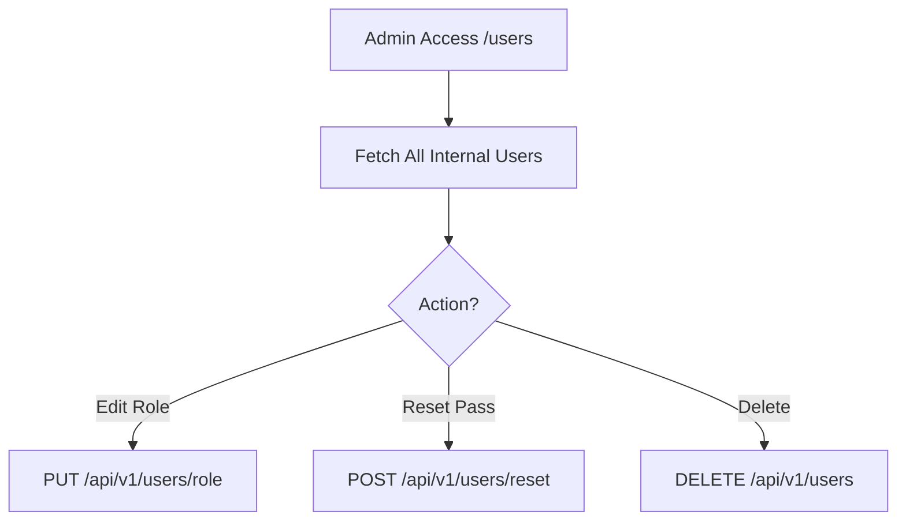

# User Management Module Documentation

The `users` module allows administrators to control application security and identity.

## Components
- **UserListComponent**: View all internal app users, change roles, or deactivate accounts.

## Configuration (RBAC)
- **Access**: Strictly restricted to ADMIN.
- **Route**: Maped to `/users`.

